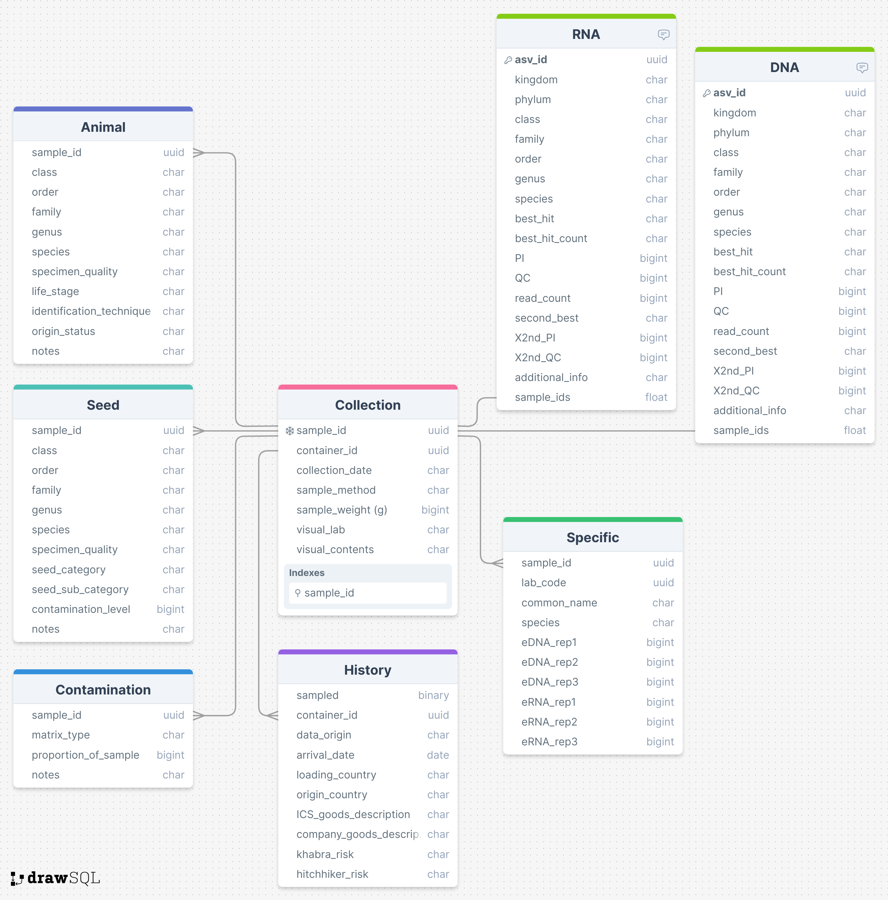

# shipping-containers
Pest insects in shipping containers eDNA and eRNA anlaysis

## Goals

* Difference between eDNA and eRNA
* Detection ~ time since arrival
* Detection ~ country (number/different container histories)
* Risk assessment (visual detection and food/habitat of pest in container)

## Original data

Original data files can be found in the folder labelled *Metabarcoding publication 2023* (owed by Alejandro Trujillo-Gonzalez)

**Shipping container meta data:**

*Metabarcoding publication 2023/Container history/*

* __Additional diagnostics extract.xlsx__ (Shipping containers)

**Species specific files:**

*Metabarcoding publication 2023/Nucleic acid data/*

* __khapra beetle_2023.xlsx__      (Khapra beetle,*Trogoderma granarium*) 
* __Electric Ant_2023.csv__        (Electric Ant, *Wasmannia auropunctata*)
* __Spotted lantern fly_2023.csv__ (Spotted lantern fly, *Lycorma delicatula*)
* __BMSB_2023.csv__                (Brown marmorated stink bug, *Halyomorpha halys*)  
* __Asian spongy moth_2023.csv__   (Asian spongy moth, *Lymantria dispar asiatica*) 

**Metabarcoding:**

*Metabarcoding publication 2023/Nucleic acid data/Metabarcoding/*

* __ASV_all_tax_count.tsv__  (eDNA)
* __ASV_cdna_tax_count.tsv__ (eRNA)

**Other**

* __C05246_metadata_sampledata.csv__ (dna extraction quality)
* __high_priority_insect_species.csv__ (Ausralia government concerns)

## Curated data

## Code

File 1:

* Directory: intitial
* File name: filter_metabarcodingDNA_file-Arthropoda.R
* Purpose: filtering the very large ASV file with all phylum to only arthropoda asvs 

File 2:

* Directory: intitial
* File name: initial_data_exploration.R
* Purpose: To identify the container ids to link all the datasets by

File 3:

* Directory: code
* File name: curate_datasets.R
* Purpose: To curate and simplify the large amounts of data (see above diagram)

File 4:

* Directory: pest_focus
* File name: days_since.R
* Purpose: DNA cq and RNA cq for species specific data against days between arrival and collection

File 5:

* Directory: pest_focus
* File name: curate_pest_data.R
* Purpose: curate data for analysis summarising by pest count/presence

File 6:

* Directory: pest_focus
* File name: pest_congruence.R
* Purpose: Comparing metabarcoding with speciese specific detections

File 7:

* Directory: pest_focus
* File name: pest_models_spp.R
* Purpose: ANALYSIS: modeling three levels of analysis for species specific data.

File 6:

* Directory: pest_focus
* File name: pest_models_meta.R
* Purpose: ANALYSIS: modeling three levels of analysis for metabarcoding data.

